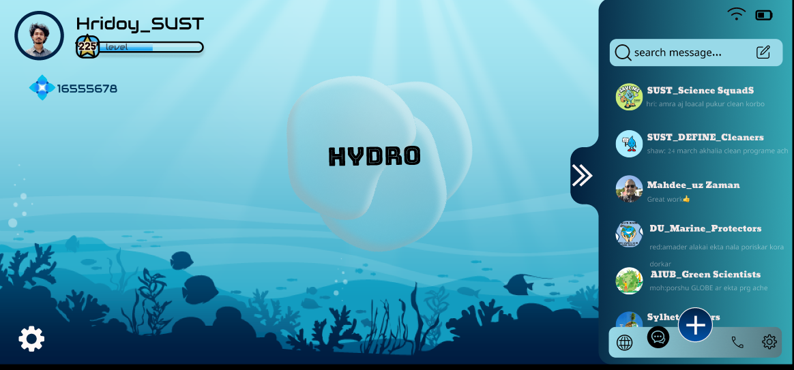

# Hydro Savior

Hydro Savior is a mobile application designed to raise awareness about water pollution and encourage public involvement in reducing plastic waste and optimizing water quality. Our app brings interactive learning, real-world action, and engaging gameplay to users to address the environmental crisis of plastic pollution in our hydrosphere.

## 🌍 Problem
Our oceans sustain life but are under threat from plastic pollution. Currently, over 400 dead zones exist globally due to contamination, and 17.6 billion pounds of plastic are dumped into the sea every year. This pollution breaks down into microplastics, affecting the water we drink, the food we eat, and even the air we breathe.

## 🚀 Solution
Hydro Savior aims to tackle this challenge by:

Creating public awareness on the effects of plastic pollution.
Providing users with interactive tools to reduce waste and optimize water quality.
Empowering users to take real-world action in their communities.

## 🎮 App Features
### 1.Learn Section                                                                                                                                                                                                  
   Dive into Water:  Education on water quality using GLOBE protocols.                                                                                                                                         
   Plastics Effect:  Insights on plastic pollution's impact and NASA’s tracking.                                                                                                                                  
   NASA Aqua Mission:  Exploration of NASA’s water monitoring efforts.

### 2.Contribute Section                                                                                                                                                                                         
   Real-World Action: Participate in cleanups, earning points.                                                                                                                                              
   Community Awareness: Collaborate and share with others.                                                                                                                                                       
   Data Entry: Contribute local water data to global research.

### 3.Game Section

   Pollution Cleanup: Use NASA data to clean polluted areas, earn coins, and engage with eco-friendly factories.

   

## Other features include:                                                                                                                                                                                      
   ### Chat Section:  
   Collaborate with others to solve water pollution challenges. 
                                                                                                                              
   ### Leaderboard: 
   Track your contributions and earn rewards for your efforts.   
                                                                                                                                     
   ### Profile Section:
   Personalize your profile, track leaderboard positions, and display earned badges.  
           

   ### AI Chatbot:
   Powered by NASA’s data, users can ask questions about water pollution and get instant responses.      
       
                                                                                          
   for more detalis about our project soluiton and goal please download this file()                                                                                                     

## 🤝 Contributing
Fork the repository.                                                                                                                                                                                           
Create a new branch (git checkout -b feature-branch).                                                                                                                                                            
Make your changes.                                                                                                                                                                                             
Submit a pull request.
